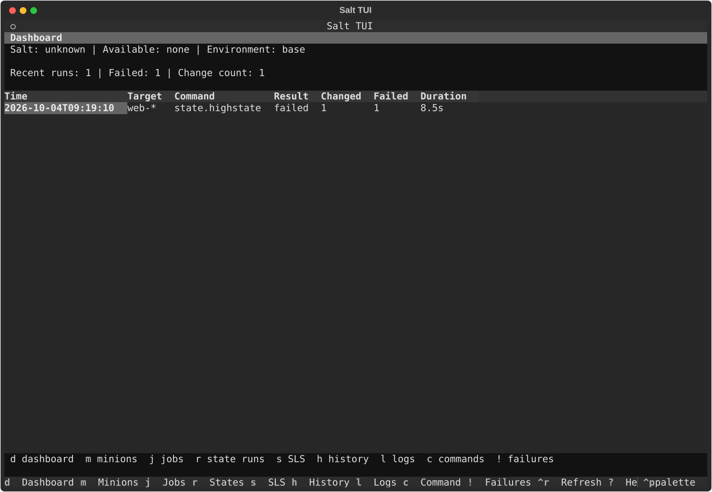
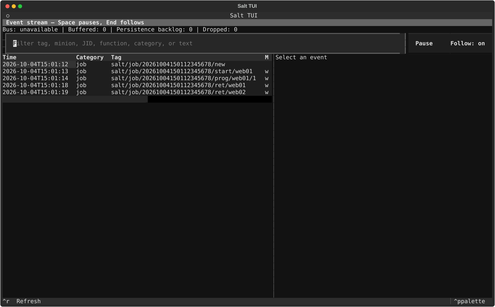

# Salt TUI

A Textual frontend for Salt CLI operations, structured state returns, local history, and SLS exploration. Salt remains the source of truth for state rendering and execution.

## Install

Python 3.11 or newer and `pipx` are required. The package uses an isolated pipx environment and does not install into Salt's Python runtime. Once a release is published on PyPI:

```sh
pipx install salt-tui
salt-tui
```

Upgrade with `pipx upgrade salt-tui` and uninstall with `pipx uninstall salt-tui`. Uninstalling leaves your configuration and history in your user directories. Check an installation without opening the TUI using `salt-tui --version` or `salt-tui --help`. Prereleases require an explicit request, such as `pipx install --pip-args='--pre' salt-tui`.

For a development checkout:

```sh
git clone https://github.com/pratik-anurag/salt-tui.git
cd salt-tui
python -m venv .venv
. .venv/bin/activate
python -m pip install -e '.[dev]'
python -m pytest
salt-tui
python -m salt_tui --version
```

To test a local release artifact, run `python -m build` and then `pipx install ./dist/salt_tui-0.1.0-py3-none-any.whl`. Use the wheel name for the version you built. Salt CLI executables are discovered at runtime on `PATH`; Salt is not a Python dependency of this package.

Without Salt binaries, the UI opens with capability information and retains local history and SLS browsing. With `salt`, master commands are available; `salt-call` enables local minion commands. The app also detects `salt-run` and `salt-key` for their supported views. Live Salt behavior depends on the installed Salt CLI and access to a Salt environment. This package has been exercised on macOS; Linux is used in CI.

## Use

`c` opens the generic command runner. Enter a normal Salt command, review the exact command preview, then run it. For state changes, a confirmation displays target, action, environment, and test mode. `Test first` adds `test=True` to state functions. `Run Live` publishes a state job asynchronously and opens minion progress when the Salt event bus is available. `e` opens the event stream and `v` returns to the selected live run. `r` opens state results; `f` and `Shift+F` visit failed states. `h` opens persisted history; highlight one run and press `x`, then another and `x` to compare state results. `s` browses configured local file roots and invokes Salt's `state.show_sls` or `state.show_low_sls` for compiled views. `g` opens the compiled dependency graph, where `u` and `n` follow connected states and `o` opens source. `j` shows Salt runner job data.

`Ctrl+M` opens a paged state × minion matrix for the selected run, with fleet drift filters and per-state details.

Direct entry points open the corresponding screen:

```sh
salt-tui sls nginx
salt-tui run state.highstate
salt-tui history
salt-tui failures
salt-tui events
salt-tui intelligence
salt-tui performance
salt-tui runner
salt-tui orchestration
salt-tui targets
salt-tui matrix
salt-tui diagnostics --output ./salt-tui-diagnostics.zip
```

Configuration is read from `~/.config/salt-tui/config.toml` (or `$XDG_CONFIG_HOME/salt-tui/config.toml`). Copy `sample-config.toml` and adapt command paths and file roots. History defaults to `$XDG_DATA_HOME/salt-tui/history.db` or `~/.local/share/salt-tui/history.db`. It does not write into Salt's cache.

See [architecture](docs/architecture.md), [plugin API](docs/plugins.md), [keyboard shortcuts](docs/keys.md), and the [release checklist](docs/releasing.md).





## Scope and limitations

Stage 2 adds event streaming, live JID-correlated master state runs, compiled graph navigation, source links, combined history search, recurring failure patterns, slow-state analysis, runner execution, orchestration, and structured job inspection. Per-state progress requires Salt's `state_events` support. The TUI tries the Salt Python event API first, then `salt-run state.event`. If neither is available, the event screen reports that the bus is unavailable and `Run Live` is disabled. Rich minion metadata, broad target match counts, and full command autocomplete remain future work. The command runner supports arbitrary Salt CLI arguments; Salt-specific option ordering should be entered as a normal CLI line.
